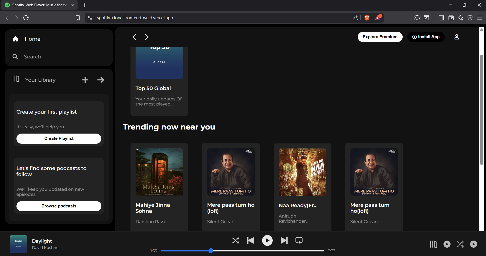

# 🎵 Spotify Clone - Frontend

A sleek, responsive, and visually appealing Spotify Clone built using HTML5 and CSS3. This project replicates the core UI components of Spotify, including navigation, library, and music player interface, offering a seamless and engaging user experience.

---

## 🖼️ Project Screenshot

  
*Screenshot showing the main UI of the Spotify Clone.*

---

## 🎥 Demo Video

  
*Click the image above to watch the project demo video.*

---

## 🚀 Live Demo

Try the deployed project online:  
[Spotify Clone Live Demo](https://spotify-clone-frontend-weld.vercel.app/)

---

## 🚩 Features

- Intuitive Navigation: Collapsible sidebar with hover effects and dynamic icons.  
- Library & Playlists: Interactive sections showcasing user playlists and podcasts.  
- Music Player Interface: Includes play, pause, and navigation controls with smooth transitions.  
- Hover & Transition Effects: Subtle scaling and color changes for a refined visual appeal.  
- Responsive Design: Fully optimized for different screen sizes (desktop, tablet, and mobile).  

---

## 🛠️ Tech Stack

- HTML5 – Structuring the webpage.  
- CSS3 – Styling and designing the entire user interface.  

---

## File Structure
.
├── assets/      # Images, icons, and videos
├── index.html   # Main HTML file
├── style.css    # Stylesheet for design
└── README.md    # Project description

---

## 💡 Installation & Usage

1. Clone the repository:  
git clone https://github.com/purvii12/spotify-clone-frontend.git

2. Navigate to the project directory:  
cd spotify-clone-frontend

3. Open the `index.html` file in your browser to view the project.

---

## 🎯 What I Learned

- Crafting responsive layouts using Flexbox for dynamic and adaptable UI.  
- Implementing hover and transition effects for enhanced visual appeal.  
- Structuring and styling a multi-section webpage with clean, modular CSS.  
- Applying consistent spacing, padding, and color schemes for a polished look.  

---

## 🔥 Future Enhancements

- Add JavaScript functionality for interactive music controls.  
- Integrate API support to fetch real-time music data.  
- Deploy the project online for easy access and showcase.  

---

## 👩‍💻 Contributing

Feel free to fork this repository and submit pull requests with improvements or fixes.

---

## ⭐ Connect with Me

If you liked this project or found it useful, consider giving it a ⭐ on GitHub.

- GitHub: [https://github.com/purvii12/spotify-clone-frontend](https://github.com/purvii12/spotify-clone-frontend)  
- LinkedIn: [https://www.linkedin.com/in/purvi-khandelwal-144ab3289/](https://www.linkedin.com/in/purvi-khandelwal-144ab3289/)

---

🚀 Author: purvii12

